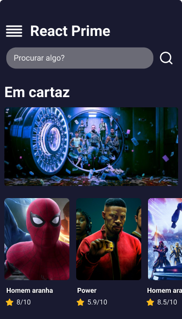

<p align="center">
  
<p/>

---

<p align="center">
     <a href="#-sobre">Sobre</a>&nbsp;&nbsp;&nbsp;|&nbsp;&nbsp;&nbsp;
    <a href="#-tecnologias">Tecnologias</a>&nbsp;&nbsp;&nbsp;|&nbsp;&nbsp;&nbsp;
    <a href="#-visualizar">Layout</a>&nbsp;&nbsp;&nbsp;|&nbsp;&nbsp;&nbsp;
    <a href="#-executar">Executar</a>&nbsp;&nbsp;&nbsp;
</p>

---
<p align="center">
    
</p>


## 🎫 Evento
Esse projeto foi desenvolvido no REACT NATIVE INSIDER.

## ✨ Sobre
Task list é uma aplicação foi projetada para criar tarefas, dividindo-as em categorias, sendo possível marcá-las ou não como lidas.

## 🛠 Tecnologias
Esse projeto foi desenvolvido com as seguintes tecnologias:
- React-native
- expo


## 🔭 Layout
Você pode ver o layout através desse [link](https://www.figma.com/file/15K5bDMfj4QdPqGN5OVyYK/Insider-4?node-id=0%3A1).

## 🚀 Executar
Clone o projeto e acesse a pasta do mesmo.

```bash
git clone https://github.com/luccasscds/insider-react-native-4.git
cd taskList
```
<!-- 
Para iniciá-lo, siga os passos abaixo:
```bash
#Instale o packajson
npm install

# Iniciar o projeto
npm run dev
```

O app estará disponível no seu browser pelo endereço http://localhost:3000. -->